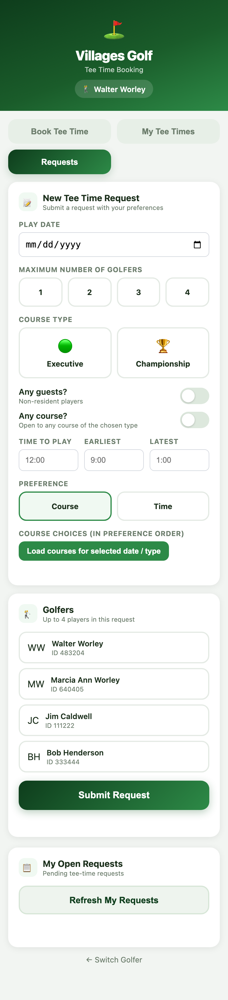
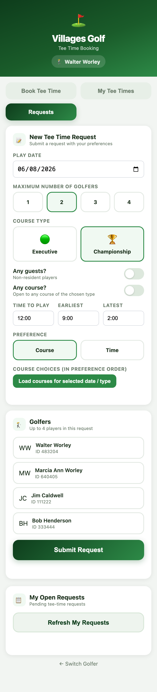
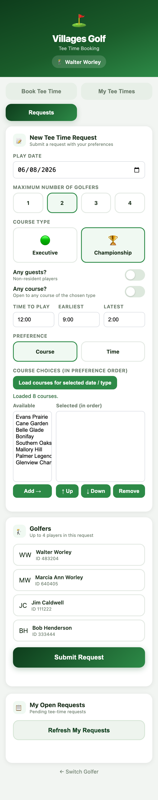
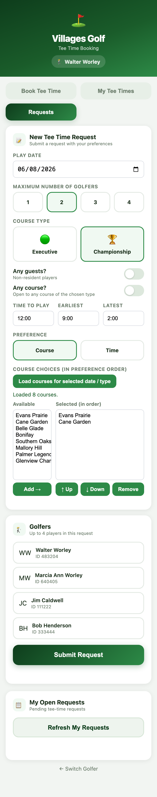
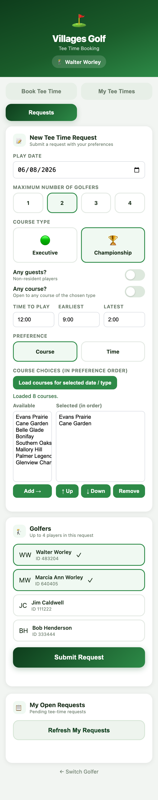
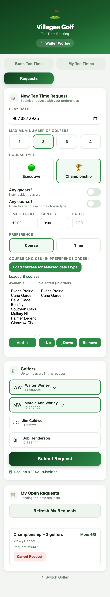

# Requests Flow — Walkthrough

The **Requests** tab lets a golfer submit a tee-time *request* with preferences
(date, course, time window, golfers) instead of grabbing a specific open slot.
The Villages system then tries to match the request. This is the better path
for popular dates, since it avoids racing the live booking screen at 7am.

> Screenshots below were captured against the live site
> (https://villagefairways.com) at iPhone width. The Villages backend calls
> were mocked at the network layer so the full UI flow could be documented
> without using real credentials — the frontend behaves exactly as a user sees
> it.

Backend: the frontend talks to `/api/request-courses`, `/api/submit-request`,
`/api/my-requests`, and `/api/delete-request`, which drive the Villages
"Requests and Templates" pages via `GolfService` (see
[`golf_service.py`](../golf_service.py)). Single Group only — max 4 golfers.

---

## 1. Open the Requests tab

The form is organized into three cards — **When**, **Course & Time**, and
**Golfers** — followed by **My Open Requests**.



## 2. Fill in preferences

- **Play Date** — the date you want to play.
- **Maximum Number of Golfers** — 1–4 (Single Group).
- **Course Type** — Executive or Championship.
- **Any guests? / Any course?** — toggles for non-resident players and
  "open to any course of this type."
- **Time to Play / Earliest / Latest** — your target time and the acceptable
  window around it.
- **Preference** — whether the system should prioritize matching your **Course**
  choice or your **Time** window when it can't satisfy both.



## 3. Load available courses

Tap **Load courses for selected date / type**. The app fetches the courses
available for that date + course type and shows them in an **Available** list.



## 4. Choose courses in preference order

Select a course and tap **Add →** to move it into **Selected (in order)**.
Use **↑ Up / ↓ Down** to rank them and **Remove** to drop one. The order is
the priority the request submits with.



## 5. Pick the golfers

Choose up to 4 golfers from your list for this request.



## 6. Submit

Tap **Submit Request**. On success the app shows a confirmation
(`Request #NNNNN submitted`) and the new request appears under
**My Open Requests**.


## 7. Manage open requests

**My Open Requests** lists each pending request with its details. **Cancel
Request** removes it from the Villages system; **Refresh My Requests** re-pulls
the current list.



---

## Regenerating these screenshots

The capture is scripted and repeatable. The script mocks the `/api/*` responses
and walks the flow with Playwright:

```bash
.venv/bin/python docs/capture_requests.py
```

Outputs overwrite `docs/screenshots/requests-0*.png`.
